# Codex Pet Dock

> 不再层层点击账户页面——让 Codex 剩余额度和本周 Token 使用量直接显示在宠物脚下。

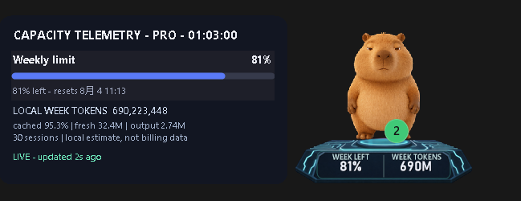

## 为什么做这个工具

Codex 桌面客户端目前不方便随时查看额度：需要进入个人账户的额度页面，
才能看到剩余比例和重置时间。专注工作时很难一眼判断“本周还剩多少”，
也缺少一个常驻但不打扰工作的本周 Token 使用量入口。

Codex Pet Dock 把现有宠物变成额度入口：

- 底座左侧显示 `WEEK LEFT`：Codex 官方接口返回的本周剩余额度；
- 底座右侧显示 `WEEK TOKENS`：根据本机 Codex 日志统计的本周模型处理量；
- 点击底座展开详情卡：查看套餐、重置时间、缓存比例、输入/输出量和数据新鲜度；
- 切换宠物时底座保持，移动宠物时底座跟随，隐藏宠物时一起隐藏。

这样不需要反复进入个人账户，也不必再放一个与宠物割裂的悬浮球。

> `WEEK TOKENS` 是本机活动估算，不是 OpenAI 账单数据；它包含缓存输入，
> 也不包含已经从本机删除的会话。界面会明确标注这一数据口径。

## 一眼展示哪些指标

| 位置 | 指标 | 数据来源 | 用途 |
|---|---|---|---|
| 底座左侧 | `WEEK LEFT` | Codex 官方 `account/rateLimits/read` | 判断本周额度还剩多少 |
| 底座右侧 | `WEEK TOKENS` | 本机 `token_count` 事件聚合 | 观察本周模型处理量 |
| 点击详情 | 套餐、额度窗口、重置时间 | Codex 官方 `app-server` | 不再进入个人账户页面查额度 |
| 点击详情 | 缓存比例、新输入、输出、会话数 | 本机日志的计数与时间戳 | 解释 Token 使用构成 |
| 状态行 | `LIVE` / `STALE DATA` | 最近成功刷新时间 | 避免把过期数据当成实时数据 |

底座只保留最常看的两个数字，点击后才展开详细信息，因此不会把宠物变成一块
拥挤的监控面板。

## 九款内置底座

科技、童话、自然、机械和东方幻想风格开箱即用。所有主题共享同样的指标语义，
但分别校准了宠物落脚面、遮挡关系、文字区域和接触阴影。

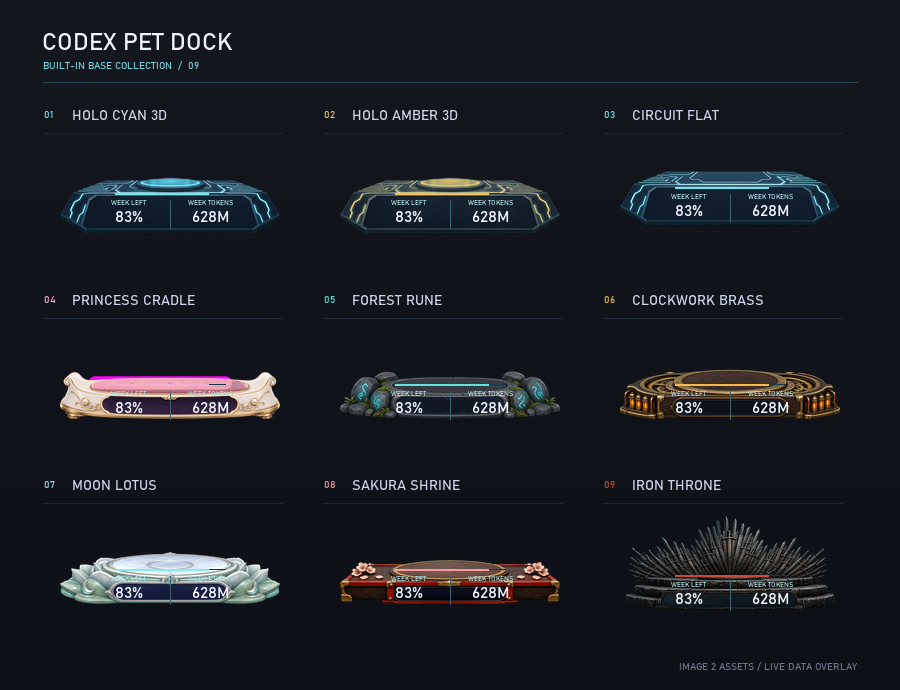

| Holo Cyan 3D | Holo Amber 3D |
|---|---|
|  | 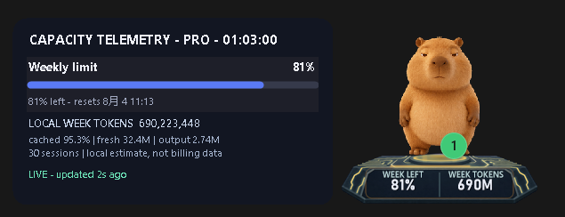 |
| 默认青色立体平台，适合作为 README 主视觉 | 暖金能量线路，同一布局的配色变体 |

| Princess Cradle | Forest Rune |
|---|---|
| 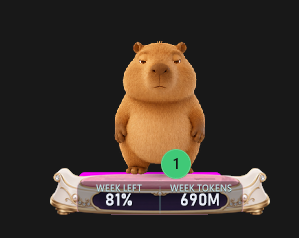 | 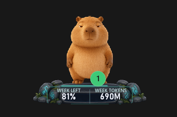 |
| 象牙白、粉色软垫与香槟金 | 苔藓古石与青色符文 |

| Clockwork Brass | Moon Lotus |
|---|---|
| 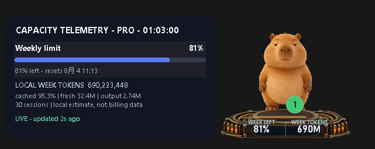 | 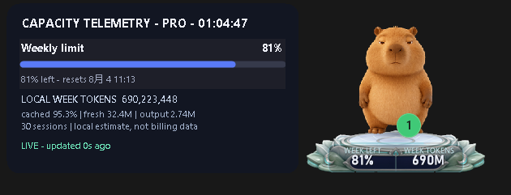 |
| 黄铜、胡桃木与琥珀能量管 | 月白瓷、青玉莲瓣与靛蓝仪表面 |

| Sakura Shrine | Iron Throne |
|---|---|
| 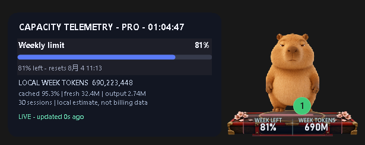 | 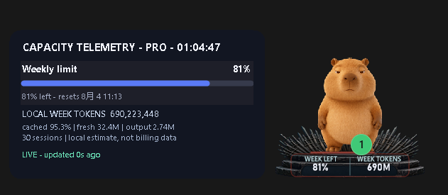 |
| 朱漆、樱花与黄铜构件 | 黑石阶、锻铁剑阵与暗红进度光 |

`Circuit Flat` 也包含在总览中，它是更薄的芯片式布局，适合希望底座更轻量的用户。

## 换宠物，底座和指标保持

Pet Dock 不依赖某一只宠物的图片或动作。用户在 Codex 中切换宠物后，当前底座、
额度状态和 Token 指标会重新锚定到新宠物脚下，无需重新配置。

<table>
  <tr>
    <th>女孩宠物</th>
    <th>Codex 机器人</th>
    <th>火焰宠物</th>
  </tr>
  <tr>
    <td>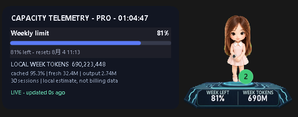</td>
    <td>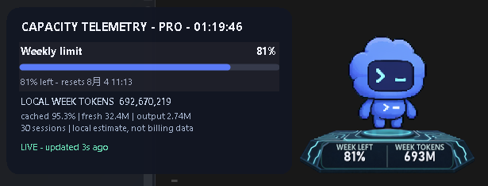</td>
    <td>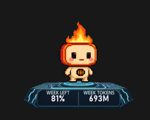</td>
  </tr>
</table>

同一只宠物的站立、坐下、奔跑动画也不会改变底座选择：

| Sakura Shrine：站立 / 坐下 | Princess Cradle：奔跑 / 坐下 |
|---|---|
| 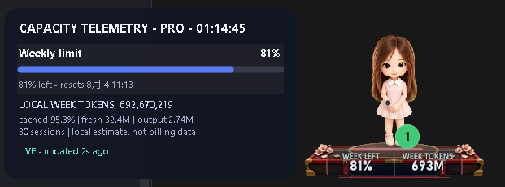 | 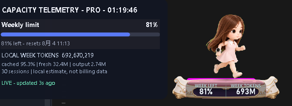 |
| 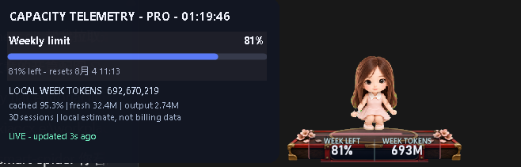 | 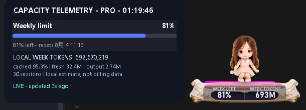 |

更多原始效果图、尺寸与 SHA-256 校验值见
[`docs/media/screenshots/`](docs/media/screenshots/README.md)。

## 下载与安装

当前 Preview 支持 Windows 11，需要：

- 已安装并登录 Codex 桌面客户端；
- Node.js 22 或更高版本；
- Codex 宠物功能可以正常打开。

安装步骤：

1. 前往 [Releases](https://github.com/hjxccc/codex-pet-dock/releases) 下载最新的
   `CodexPetDock-*.zip`；
2. 解压 ZIP；
3. 双击 `Install-Preview.cmd`；
4. 安装器会创建开始菜单入口、启用当前用户登录自启，并立即启动 Pet Dock。

安装只作用于当前 Windows 用户，不需要管理员权限，也不会修改 Codex 的安装目录、
`app.asar`、宠物包或快捷方式。不希望登录自启时，可随时在托盘菜单取消
`Launch at sign-in`。

## 开始使用

1. 打开 Codex，并显示一只宠物；
2. 从开始菜单启动 `Codex Pet Dock`；
3. 底座会自动出现在宠物脚下；
4. 直接查看 `WEEK LEFT` 和 `WEEK TOKENS`；
5. 点击底座展开详细额度卡，再次点击收起。

右下角托盘图标提供常用操作：

| 菜单 | 作用 |
|---|---|
| `Refresh` | 立即刷新额度和本周 Token |
| `Base theme` | 切换内置或自定义底座 |
| `Language` | 在英文和简体中文之间即时切换 |
| `Launch at sign-in` | 登录 Windows 后在后台等待宠物出现 |
| `Exit` | 关闭 Pet Dock |

宠物移动时底座会跟随；切换宠物时自动重新贴合；宠物关闭或隐藏后，底座和详情卡
也会一起隐藏。重复启动不会创建第二块底座，只会提示当前运行状态。

## 界面语言

界面默认使用英文。右键托盘图标，选择
`Language` → `简体中文` 可以即时切换为中文，无需重启。选择结果与当前底座
主题一起保存到 `%LOCALAPPDATA%\CodexPetDock\config.json`，Theme Studio
会自动使用相同语言。

## 切换内置底座

托盘菜单 `Base theme` 可以直接切换：

- `Holo Cyan 3D`：默认的青色立体承托平台
- `Holo Amber 3D`：暖金色能量线路
- `Circuit Flat`：更薄的平面芯片样式
- `Princess Cradle`：象牙白、粉色软垫和香槟金的公主摇篮
- `Forest Rune`：苔藓古石与青色符文的森林祭坛
- `Clockwork Brass`：黄铜、胡桃木和琥珀能量管的机械台
- `Moon Lotus`：月白瓷、青玉莲瓣和靛蓝仪表面的月光莲台
- `Sakura Shrine`：朱漆、樱花与黄铜构件组成的神社舞台
- `Iron Throne`：黑石阶、锻铁剑阵与暗红进度光组成的特殊高背王座

选择会自动保存，升级或重新安装 Pet Dock 后不会丢失。

## 创建自己的底座

项目支持本地、纯数据自定义底座，有两种方式：

### 方式一：交给编码助手（推荐）

不用自己研究尺寸或 JSON。复制项目准备好的完整任务提示词，填一句风格描述，再交给
Codex、Claude Code 等能够读写本机文件的编码助手。它会在安全边界内完成：

1. 生成或检查透明底座 PNG；
2. 创建白名单格式的 `theme.json`；
3. 校准宠物落脚面、指标区域与文字可读性；
4. 在临时配置中运行布局和切换诊断；
5. 通过后安装到本机主题目录并请求热重载。

例如只需把提示词中的设定改成：

```text
主题概念：淡金色东方祥云，轻盈、帅气、有层次，不要俗艳
主题显示名：Golden Nimbus
稳定主题 ID：your-name.golden-nimbus
现有透明 PNG：无
```

完整可复制提示词见
[`docs/vibe-custom-theme-prompt.md`](docs/vibe-custom-theme-prompt.md)。
提示词明确禁止修改 Codex、`app.asar` 和 Pet Dock 源码，也禁止主题携带脚本。

### 方式二：Theme Studio 手工调整

选择 `Base theme` → `Create or edit custom base...` 打开 Theme Studio，导入一张
透明 PNG，在实时预览中调整宠物落脚线、尺寸、文字位置和颜色，然后
`Save & reload`，无需重启 Pet Dock。

熟悉配置文件的用户也可以选择 `Open custom themes folder`，手动建立包含 `theme.json`
与透明 PNG 的主题目录，再点击 `Reload custom themes`。

加载器只接受固定白名单字段和同目录 PNG；脚本、CSS、JavaScript、命令、
URL、绝对路径、目录穿越、符号链接、超大文件与不安全尺寸都会被拒绝。
完整格式和设计建议见 [`docs/custom-themes.md`](docs/custom-themes.md)。


## 隐私与性能

- 额度通过 Codex 官方 `app-server` 的账户读取方法获取；不会读取或复制
  `auth.json`、Access Token、邮箱或会话正文。
- `WEEK TOKENS` 只聚合本机日志中的 Token 计数与时间戳，不上传日志。
- 宠物关闭或隐藏后，底座和详情卡立即隐藏，额度探测进程停止；后台只以 1 秒间隔
  轻量检查宠物是否重新出现。
- 宠物静止时降低跟随频率，拖动期间才短暂提升刷新率；额度默认每 5 分钟刷新一次，
  也可从托盘手动刷新。

更多说明见 [`PRIVACY.md`](PRIVACY.md) 和 [`SECURITY.md`](SECURITY.md)。

## 常见问题

### 重启 Windows 或 Codex 后没有底座

先确认已经运行 `Install-Preview.cmd`，而不是只从源码目录临时启动。安装器默认启用
当前用户登录自启，Pet Dock 会在后台等待 Codex 宠物出现；托盘菜单中的
`Launch at sign-in` 必须保持勾选。只重启 Codex 时不需要重新启动 Pet Dock。

如果仍未出现：

1. 从开始菜单打开 `Codex Pet Dock`；
2. 在 Codex 中确认宠物处于显示状态；
3. 查看托盘状态，点击 `Refresh`；
4. 检查 `%LOCALAPPDATA%\CodexPetDock\sidecar.log` 中是否有恢复记录。

### Windows 询问“用什么方式打开 npm”

Pet Dock 不调用 `npm`，只直接执行 `node.exe`。此弹窗通常表示 Node.js 安装或
`PATH` 中存在一个无扩展名的 `npm` 文件，遮挡了正确的 `npm.cmd`。可在终端运行
`Get-Command npm,npm.cmd -All` 和 `where.exe npm` 找出冲突项；修复 Node.js
安装或 PATH 后应让 `npm.cmd --version` 正常输出。不要随意删除无法确认来源的
系统目录文件。

### 如何关闭自动启动或卸载

取消托盘菜单中的 `Launch at sign-in` 即可关闭登录自启。卸载可使用开始菜单里的
`Uninstall Codex Pet Dock`；自定义主题和配置会保留在
`%LOCALAPPDATA%\CodexPetDock`，便于以后恢复。

## 当前 Preview 的限制

- 已有每用户 Preview 安装器、单实例保护和开机启动开关，但还没有签名的
  `Setup.exe` 或自动更新。
- 宠物窗口识别依赖 Windows 顶层窗口特征；精确贴合还依赖宠物元素的 UI Automation 类名。升级后若任一结构改变，会回退到窗口锚点或安全隐藏，不会注入官方进程。
- 底座是独立窗口，因此不能真正成为 Codex 宠物 DOM 的子节点；这是换取不注入、不改包和更好升级兼容性的代价。
- 当前只显示官方接口实际返回的限额窗口。若 5 小时窗口暂未出现，就只显示周窗口。
- 本周 Token 是本机“模型处理量”统计，包含缓存输入，不等同于 OpenAI 服务端账单，也不会包含已从本机删除的会话。点击底座可查看非缓存输入、缓存比例和输出量。

## 开发者资料

| 内容 | 文档 |
|---|---|
| 产品定位与指标设计 | [`PRODUCT.md`](PRODUCT.md) |
| 窗口附着、DPI、数据流与安全边界 | [`docs/architecture.md`](docs/architecture.md) |
| 自定义主题契约 | [`docs/custom-themes.md`](docs/custom-themes.md) |
| Vibe Coding 自定义主题提示词 | [`docs/vibe-custom-theme-prompt.md`](docs/vibe-custom-theme-prompt.md) |
| 安装、更新与独立可执行文件路线 | [`docs/distribution.md`](docs/distribution.md) |
| 一键接入方案 | [`docs/one-click-onboarding.md`](docs/one-click-onboarding.md) |
| 可行性与升级兼容性 | [`docs/feasibility.md`](docs/feasibility.md) |
| 效果图原文件与校验值 | [`docs/media/screenshots/`](docs/media/screenshots/README.md) |

运行回归测试：

```powershell
powershell -NoProfile -ExecutionPolicy RemoteSigned `
  -File .\tests\Test-CodexPetDock.ps1 -SkipIntegration
```

构建可分发 ZIP 与 SHA-256：

```powershell
powershell -NoProfile -ExecutionPolicy RemoteSigned `
  -File .\packaging\Build-Preview.ps1
```

参考：[OpenAI Codex app-server 文档](https://github.com/openai/codex/blob/main/codex-rs/app-server/README.md)、
[Codex Dream Skin](https://github.com/Fei-Away/Codex-Dream-Skin)。
