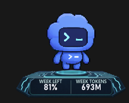

# Screenshot library

Stable, original PNG captures for the Codex Pet Dock README, release notes,
articles, and social posts. These files are copied from the user's source
captures without resizing or recompression.

Captured: 2026-07-29

## Recommended use

- Hero image: `capybara-holo-cyan-details.png`
- Alternate hero: `capybara-moon-lotus-details.png`
- Theme gallery: use the eight `capybara-*` images
- Pet switching demo: compare the three `pet-switch-*-holo-cyan-*` pets
- Animation compatibility demo: use the standing, sitting, and running girl captures
- Custom-theme article: pair one detail screenshot with the Theme Studio flow
- Exact dimensions and SHA-256 values: see `manifest.json`

Before publishing publicly, decide whether to keep or blur the exact Token
totals and reset time. The screenshots do not show an account name, email,
prompt, or conversation content.

## Gallery

### Holo Cyan 3D


### Holo Amber 3D


### Princess Cradle


### Forest Rune


### Clockwork Brass


### Moon Lotus


### Sakura Shrine


### Iron Throne


## Pet switching with the base preserved

These captures demonstrate that the pet and the metric base have independent
lifecycles. Users can switch the Codex pet while the selected base theme,
quota values, and detail card remain in place. The same base can therefore
support built-in and custom pets without modifying the pet package.

For a concise README comparison, place the following three Holo Cyan captures
side by side:

1. `pet-switch-girl-holo-cyan-details.png`
2. `pet-switch-codex-holo-cyan-details.png`
3. `pet-switch-flame-holo-cyan-compact.png`

### Girl pet on Holo Cyan


### Codex pet on Holo Cyan


### Flame pet on Holo Cyan


### Codex pet, compact presentation



## Pet animation and different bases

The following captures show that standing, sitting, and running poses can
change without separating the base from the pet.

### Girl pet standing on Sakura Shrine


### Girl pet sitting on Sakura Shrine


### Girl pet running on Princess Cradle


### Girl pet sitting on Princess Cradle


## How users add a custom base

No source-code changes are required.

1. Right-click the Codex Pet Dock tray icon.
2. Choose `Base theme` -> `Create or edit custom base...`.
3. Select a transparent PNG.
4. Adjust runtime size, the dashed pet contact surface, overlap, metric offset,
   scrim strength, compact text, and accent color.
5. Choose `Save & reload`.
6. Select `Custom - <theme name>` from the `Base theme` menu.

Advanced authors may place `theme.json` and `platform.png` under:

```text
%LOCALAPPDATA%\CodexPetDock\themes\<theme-id>\
```

Then choose `Reload custom themes`. Custom themes are data-only: scripts,
commands, URLs, CSS, and JavaScript are rejected. See
[`../../custom-themes.md`](../../custom-themes.md) for the complete manifest.
